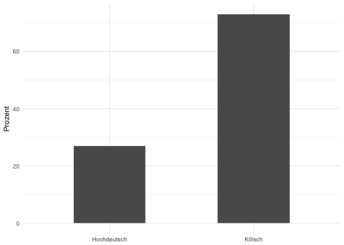
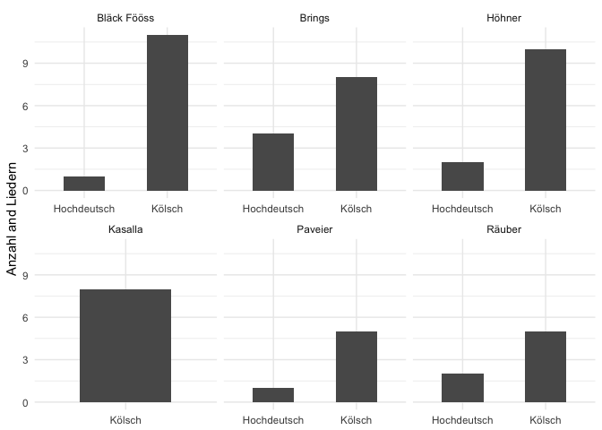
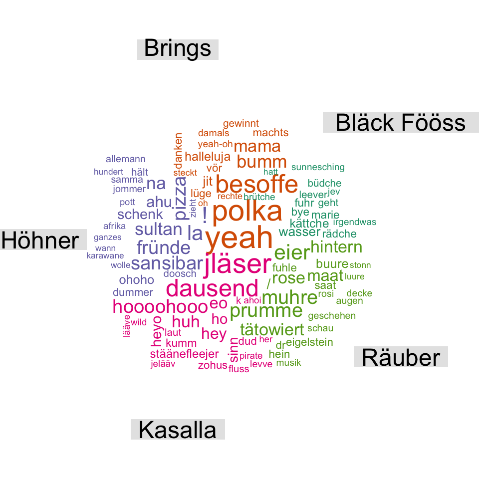
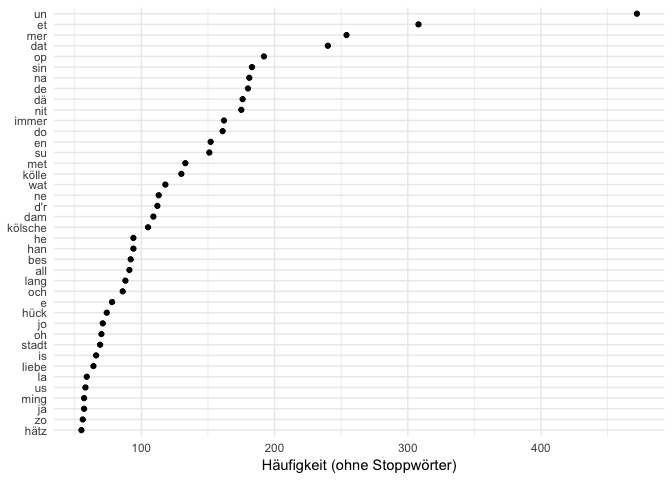

Eine quantitative Textanalyse der 100 beliebtesten kölschen Karnevalslieder
================
Stefan Müller

Die Website [karnevalslieder.koeln](http://www.karnevalslieder.koeln/top-100.html) hat sich den Aufwand gemacht, die am 100 häufigsten auf Youtube gespielten kölschen Karnevalslieder zu finden Die Tabelle findet sich [hier](www.karnevalslieder.koeln). Um zwei meiner Hobbies (Karneval und quantitative Textanalyse) zu verknüpfen, habe ich einen Textkorpus erstellt, der alle Songtexte dieser Top-100-Songs enthält. Hier zeige ich, welche Bands am häufigsten vertreten sind, wie sich die Wortwahl unterscheidet, und ob man mitteils eines "trainierten" Klassifikators ermitteln kann, ob ein Song auf hochdeutsch oder kölsch geschrieben wurde. Gleichzeitig gebe gleichzeitig noch einen Einblick in quantitative Textanalyse mit unserem [**quanteda**](www.quanteda.io)-Package. Visualisierungen und Data Wrangling wurde mit der [**tidyverse**](www.tidyverse.org) durchgeführt.

Beschreibende Statistiken
-------------------------

Dies sind die Top-10 Songs basierend auf den Youtube-Aufrufen:

``` r
data %>% 
    select(Rang, Interpret, Titel, Jahr) %>% 
    filter(Rang <= 10) %>% 
    knitr::kable()
```

|  Rang| Interpret                               | Titel                     |  Jahr|
|-----:|:----------------------------------------|:--------------------------|-----:|
|     1| Brings                                  | Kölsche Jung              |  2013|
|     2| Kasalla                                 | Pirate                    |  2011|
|     3| Cat Ballou                              | Et jitt kei Wood          |  2012|
|     4| Trude Herr                              | Ich will keine Schokolade |  1965|
|     5| Brings                                  | Polka, Polka, Polka       |  2014|
|     6| Kasalla                                 | Alle Jläser huh           |  2014|
|     7| Höhner                                  | Schenk mir Dein Herz      |  2009|
|     8| Paveier                                 | Leev Marie                |  2015|
|     9| Kasalla                                 | Stadt met K               |  2015|
|    10| Mo-Torres & Cat Ballou & Lukas Podolski | Liebe Deine Stadt         |  2016|

Für alle Nicht-Karnvelisten: das hier ist die Nummer 1: <https://www.youtube.com/watch?v=DcNPqsWPbD8>

Im nächsten Schritt analysieren wir, welche Bands die meisten Songs unter den Youtube-Top-100 haben.

``` r
# Berechne die Anzahl der Top 100-Lieder pro Interpret
data_by_artist <- data %>% 
    group_by(Interpret) %>% 
    summarise(number_songs = n()) %>% 
    filter(number_songs > 1) 

# Erstelle Plot
ggplot(data_by_artist, aes(x = reorder(Interpret, number_songs), y = number_songs)) + 
    geom_bar(stat = "identity", width = 0.1) +
    geom_point(size = 2) +
    scale_y_continuous(limits = c(0, 12), breaks = c(seq(0, 12, 2))) +
    coord_flip() +
    labs(x = NULL, y = "Anzahl an Titeln unter den Top 100")
```


Wie zu erwarten, teilen sich die "Fööss", Höhner und Brings Platz 1 mit jeweils 12 Liedern. Im nächsten Schritt schauen wir, aus welchen Jahren die Lieder stammen. Da das Yotube-Publikum generell jünger ist und viele der alten Klassiker (leider) womöglich nicht kennt, ist es zu vermuten, dass die meisten Songs aus den letzten 10-15 Jahren stammen.

``` r
# Berechne die Anzahl der Top 100-Liedern pro Jahr
data_by_year <- data %>% 
    group_by(Jahr) %>% 
    summarise(number_songs = n()) 

# Erstelle Plot
ggplot(data_by_year, aes(x = Jahr, y = number_songs)) + 
    geom_bar(stat = "identity", width = 0.5) +
    scale_x_continuous(limits = c(1930, 2020), breaks = c(seq(1930, 2020, 20))) +
    scale_y_continuous(limits = c(0, 12), breaks = c(seq(0, 12, 2))) +
    labs(x = "Jahr", y = "Lieder")
```


Tatsächlich wurden die meisten Songs in den 2000ern veröffentlicht.

Und welche Lieder sind die ältesten unter den Top-100?

``` r
data %>% 
    dplyr::select(Jahr, Rang, Interpret, Titel) %>% 
    top_n(n = -10, wt = Jahr) %>% 
    arrange(Jahr) %>% 
    knitr::kable()
```

|  Jahr|  Rang| Interpret         | Titel                                     |
|-----:|-----:|:------------------|:------------------------------------------|
|  1936|    71| Karl Berbuer      | Heidewitzka Herr Kapitän                  |
|  1948|    92| Karl Berbuer      | Die Eingeborenen von Trizonesien          |
|  1949|    23| Jupp Schmitz      | Wer soll das bezahlen                     |
|  1950|    87| Willy Schneider   | Wenn das Wasser im Rhein goldner Wein wär |
|  1950|    95| Toni Steingass    | Der schönste Platz ist immer an der Theke |
|  1965|     4| Trude Herr        | Ich will keine Schokolade                 |
|  1966|    73| Ernst Neger       | Humba Tätärä                              |
|  1969|    96| Jupp Schmitz      | Es ist noch Suppe da                      |
|  1970|    79| Margit Sponheimer | Am Rosenmontag bin ich geboren            |
|  1971|    16| Bläck Fööss       | Drink doch eine met                       |

Kölsch oder Hochdeutsch?
------------------------

Sind die Top-Song seher auf kölsch oder hochdeutsch verfasst? Das können wir leicht rausfinden.

``` r
ggplot(data, aes(x = Sprache)) +
    geom_bar(width = 0.5) +
    labs(x = NULL, y = "Prozent")
```



Kölsch überwiegt. Während 23 der 100 Songs auf hochdeutsch verfasst wurde, sind über drei Viertel der Lieder auf platt. In diesem Sinne: "[Su lang beim Lommi die Leechter noch brenne. Su lang ‘ne Funk weiß, wie Stippefott jeiht. Su lang dä Pitter noch schläht, dä Speimanes noch speit. Jo, su lang stirv dä Kölsche nit us.](https://www.youtube.com/watch?v=h31ksztZee4)"

Nun das Ganze aufgeschlüsselt nach Bands mit über sechs Songs.

``` r
data %>% 
    filter(count_songs >= 6) %>% 
    ggplot(aes(x = Interpret, fill = Sprache)) +
    geom_bar(width = 0.2, position = position_dodge(width = 0.3)) +
    labs(x = NULL, y = "Lieder") + 
    coord_flip() +
    guides(fill = guide_legend(reverse = T))
```



Kasalla ist die einzige Band, die alle Lieder aus dem Datensatz auf platt verfasst haben, gefolgt von den Bläck Fööss Die größte Mischung aus Liedern auf platt und hochdeutsch haben Brings.

Haben kölsche Songs eine höhere Wahrscheinlichkeit mehr Aufrufe zu erhalten? Wir nutzen einen so genannten [t-test](https://en.wikipedia.org/wiki/Student's_t-test) und visualisieren die Verteilung als Boxplots.

``` r
t.test(Rang ~ Sprache, data = data)
```

    ## 
    ##  Welch Two Sample t-test
    ## 
    ## data:  Rang by Sprache
    ## t = 1.4346, df = 43.048, p-value = 0.1586
    ## alternative hypothesis: true difference in means is not equal to 0
    ## 95 percent confidence interval:
    ##  -3.941434 23.373194
    ## sample estimates:
    ## mean in group Hochdeutsch      mean in group Kölsch 
    ##                  57.59259                  47.87671

``` r
ggplot(data = data, aes(x = Sprache, y = Rang)) + 
    geom_boxplot(width = 0.3, colour = "red") +
    scale_y_reverse() + 
    ggbeeswarm::geom_quasirandom(alpha = 0.9, width = 0.1) +
    labs(x = NULL, y = "Position in Top 100")
```


Jeder Punkt markiert ein Lied. Der Boxplot zeigt den Median-Wert beider Kategorien und den so genannte Quartilsabstand (in diesem Bereich liegen 50 Prozent der Songs in der jeweiligen Kategorie). Kölsche Songs haben einen geringeren Medianwert, was darauf schließen lässt, dass kölsche Lieder weiter Oben auf der Liste stehen. Der obige T-test zeigt jedoch, dass der Unterschied nicht statistisch signifikant ist.

Eine automatische Dialekt-Klassifikation
----------------------------------------

Ist es möglich, anhand der Worthäufigkeiten automatisch zu ermitteln, ob ein Lied auf hochdeutsch oder kölsch verfasst ist? Um das herauszufinden, habe ich einen Naive Bayes-Klassifizierer erstellt. Die Idee ist einfach: Für die ersten 50 Songs nennen wir die Sprache und ermitteln, wie gut die automatische Klassifikation für die restlichen Titel funktioniert.

``` r
# Splitte Daten in Training- und Testset
corpus_training <- data[1:50, ] %>% 
    corpus()

corpus_test <- data[51:100, ] %>% 
    corpus()

dfm_training <- dfm(corpus_training)

nb_classifier <- textmodel_nb(dfm_training, docvars(corpus_training, "Sprache"))

summary(nb_classifier)
```

    ## 
    ## Call:
    ## textmodel_nb.dfm(x = dfm_training, y = docvars(corpus_training, 
    ##     "Sprache"))
    ## 
    ## Class Priors:
    ## (showing first 2 elements)
    ## Hochdeutsch      Kölsch 
    ##         0.5         0.5 
    ## 
    ## Estimated Feature Scores:
    ##                 oh      , yeah-oh deutschunterricht    dat   wor    nix
    ## Hochdeutsch 0.4753 0.2807  0.2185            0.5571 0.0986 0.107 0.1226
    ## Kölsch      0.5247 0.7193  0.7815            0.4429 0.9014 0.893 0.8774
    ##                för   mich   dann    ming sproch    die    jof     et
    ## Hochdeutsch 0.3075 0.4561 0.3307 0.06367 0.1733 0.4698 0.5571 0.0762
    ## Kölsch      0.6925 0.5439 0.6693 0.93633 0.8267 0.5302 0.4429 0.9238
    ##                 do    nit      „ sprech ödentlich      !      "   hät
    ## Hochdeutsch 0.1639 0.1127 0.3861 0.4561    0.5571 0.2815 0.1733 0.201
    ## Kölsch      0.8361 0.8873 0.6139 0.5439    0.4429 0.7185 0.8267 0.799
    ##                 de    mam jesaht     di zeuchniss   weed   kene
    ## Hochdeutsch 0.1143 0.3348 0.5571 0.2954    0.5571 0.1436 0.5571
    ## Kölsch      0.8857 0.6652 0.4429 0.7046    0.4429 0.8564 0.4429

Die "Estimated Feature Scores" zeigen uns die Wahrscheinlichkeit für jedes der Worte, ob es eher zu Kölsch oder Hochdeutsch gehört. Beispielsweise ist der Unterschied bei "oh" sehr gering (52-prozentige Wahrscheinlichekeit für "Kölsch", 47-prozentige Wahrscheinlichkeit für "Hochdeutsch"). Auf der anderen Seite haben Worte wie "dat", "wor", "nit" eine viel höhere Wahrscheinlichkeit, in kölschen Liedern vorzukommen. Diese Informationen werden genutzt, um die Sprache der restlichen Lieder vorherzusagen.

``` r
# Erstelle Test-dfm
dfm_test <- dfm(corpus_test)

# Nimm nur Worte, die sowohl im Test- als auch im Trainingset existieren
dfm_test_select <- dfm_select(dfm_test, dfm_training)

# Wende Klassifikation an
nb_predict <- predict(nb_classifier, dfm_test_select)

# Checke, wie gut die Klassifikation geklappt hat
table(actual_language = docvars(corpus_test, "Sprache"),
       predicted_language = nb_predict)
```

    ##                predicted_language
    ## actual_language Hochdeutsch Kölsch
    ##     Hochdeutsch          18      0
    ##     Kölsch                0     32

Die Klassifikation funktioniert perfekt. Mit nur 50 annotierten Liedern kann die Sprache der restlichen Lieder fehlerfrei vorhergesagt werden.

Quantitative Textanalyse
------------------------

Im nächsten Schritt geht es ans Eingemachte: wir schauen uns die Inhalte der Songtexte an. Zunächst erstellen wir dafür mit dem **quanteda**-Package einen Textkorpus.

``` r
# Erstelle Text-Korpus des data frames
corpus_leeder <- corpus(data, text_field = "text") 
corpus_leeder
```

    ## Corpus consisting of 100 documents and 7 docvars.

``` r
# Erstelle bessere Namen für Songs
docnames(corpus_leeder) <- paste(docvars(corpus_leeder, "title_short"),
                                 docvars(corpus_leeder, "Jahr"), sep = ", ")
```

Nun nutzen wir die Keyword-in-Context-Funktion, um zu schauen, in welchen Zusammenhängen die Worte "fiere" (feiern), "drink" und "alaaf" vorkommen. Hierbei wird nicht zwischen Groß- und Kleinschreibung unterschieden.

``` r
# Keyword-in-Context-Analyse
corpus_leeder %>% 
    tokens(remove_punct = TRUE) %>% 
    kwic(c("fiere*", "drink*", "alaaf"), window = 2)
```

    ##                                                                  
    ##   [Polka, P, 2014, 43]      et Lävve |  fiere  | Polka Polka     
    ##   [Alle Jlä, 2014, 13]      Dir eine | drinke  | jonn eo         
    ##   [Alle Jlä, 2014, 99]      Kumm mer | drinke  | uch met         
    ##  [Alle Jlä, 2014, 132]        jet ze |  fiere  | häs eo          
    ##  [Alle Jlä, 2014, 215]      Kumm mer | drinke  | uch met         
    ##  [Alle Jlä, 2014, 240]      Kumm mer | drinke  | uch met         
    ##  [Alle Jlä, 2014, 319]      Kumm mer | drinke  | uch met         
    ##  [Alle Jlä, 2014, 344]      Kumm mer | drinke  | uch met         
    ##  [Alle Jlä, 2014, 381]      Kumm mer | drinke  | uch met         
    ##  [Stadt me, 2015, 113]       is laut |  drink  | vill un         
    ##      [Helau, 2015, 50]      säht mer |  Alaaf  | Ich fing        
    ##   [Drink do, 1971, 13]      ens eine | drinken | däht Doch       
    ##   [Drink do, 1971, 52]    einfach an |  Drink  | doch eine       
    ##   [Drink do, 1971, 77]     janz ejal |  drink  | doch met        
    ##  [Immer no, 2012, 129]         do do |  Drink  | mit mir         
    ##  [Immer no, 2012, 231]         do do |  Drink  | mit mir         
    ##  [Immer no, 2012, 301]         do do |  Drink  | mit mir         
    ##  [Immer no, 2012, 347]         do do |  Drink  | mit mir         
    ##   [Viva Col, 2002, 44]       KEC Mir | drinke  | jän e           
    ##   [Viva Col, 2002, 61]      loss Mir |  fiere  | jän ejal        
    ##  [Viva Col, 2002, 112]         et he |  Alaaf  | un Ruusemondaach
    ##  [Ich bin , 2012, 104]   heiss Kölle |  Alaaf  | Ich deit        
    ##  [Ich bin , 2012, 208]   heiss Kölle |  Alaaf  | Ich rode        
    ##  [Ich bin , 2012, 318]   heiss Kölle |  Alaaf  |                 
    ##   [Ich ben , 1982, 15]       mich an | drinks  | de met          
    ##  [Mir sin , 2008, 112]     Rhing Mer |  fiere  | Fastelovend mit 
    ##  [Mir sin , 2008, 128]        FC Mer |  fiere  | uns jän         
    ##  [Heimat e, 2011, 103]      fällt et |  Fiere  | jo nit          
    ##  [Naturbek, 2013, 128]   gesaht Jung | drinks  | de eine         
    ##  [Mir Köls, 1994, 181] Dreimol Kölle |  Alaaf  |                 
    ##   [Denn wen, 1993, 59]  jesaat Kölle |  Alaaf  | Alaaf Kölle     
    ##   [Denn wen, 1993, 60]   Kölle Alaaf |  Alaaf  | Kölle Alaaf     
    ##   [Denn wen, 1993, 62]   Alaaf Kölle |  Alaaf  | Jo am           
    ##  [Denn wen, 1993, 121]  jesaat Kölle |  Alaaf  | Alaaf Kölle     
    ##  [Denn wen, 1993, 122]   Kölle Alaaf |  Alaaf  | Kölle Alaaf     
    ##  [Denn wen, 1993, 124]   Alaaf Kölle |  Alaaf  |

Was sagt uns diese Tabelle: Die Kölner lieben das "Alaaf" und trinken sehr gerne. Und in vielen Texten wiederholt sich eine Phrase (Refrain!).

Im nächsten Schritt plotten wir die 40 häufigsten Begriffe über alle Lieder hinweg.

``` r
# Erstelle dfm, entferne deutsche Stopwörter, Nummern und Punktuation
dfm_leeder <- dfm(corpus_leeder,
                  remove = stopwords("german"),
                  remove_punct = TRUE, 
                  remove_numbers = TRUE)

# Plotte die 40 häufigsten Begriffe
most_frequent_words <- textstat_frequency(dfm_leeder, n = 40)
ggplot(most_frequent_words, aes(x = reorder(feature, frequency), y = frequency)) +
    geom_point() + 
    coord_flip() +
    labs(x = NULL, y = "Häufigkeit")
```



Die Kölner sprechen gerne über sich ("mer", "ming", "sin") und ihre Stadt ("kölle", "kölsche", "stadt"). Allerdings befinden sich unter den Worten immer noch viele Pronomen, Artikel und Füllwörter. Deshalb gehen wir im nächsten Abschnitt einen Schritt weiter und untersuchen, wie sich die Wortwahl der Interpreten unterscheidet.

Wordclouds
----------

Als nächstes fokussieren wir uns auf die Interpreten, die mit mindestens sechs Titeln vertreten sind und erstellen eine Wordcloud basierend auf den [tf-idf-Werten](https://de.wikipedia.org/wiki/Tf-idf-Maß). Grob gesprochen stellt tf-idf diejenigen Begriffe hervor, die von dem jeweiligen Interpreten überproportional vorkommen (verglichen mit allen anderen Interpreten).

``` r
# Nur Gruppen mit mehr als sechs Liedern
corpus_leeder_subset_wordcloud <- corpus_leeder %>% 
    corpus_subset(count_songs > 6)

# Erstelle Wordcloud
set.seed(111)
corpus_leeder_subset_wordcloud %>% 
    dfm(remove = stopwords("german")) %>% 
    dfm_group(groups = docvars(corpus_leeder_subset_wordcloud, "Interpret")) %>%
    dfm_tfidf() %>% 
    textplot_wordcloud(comparison = TRUE, max_words = 70)
```



Eins fällt auf: manche Lieder haben einen großen Einfluss, beispielsweise "Dausend Levve" bei Kasalla, "Op de Maat" (Räuber), "Polka, Polka, Polka" (Bläck Fööss) und "Pizza Wunderbar" (Pizza). Denn die Inhalte dieser Lieder unterscheiden sich sehr von den Titeln der anderen Bands (und beinhalten sich wiederholende Schlagwörter).

Wordfish für Karnevalsbands
---------------------------

Abschließend ein Experiment: Wir nutzen die Scaling-Methode "Wordfish" ([Slapin and Proksch 2008](http://www.svenoliverproksch.com/uploads/1/2/9/8/12985397/slapin_proksch_ajps_2008.pdf)), um alle Bands mit mehr als zwei Songs auf einer eindimensionalen Ebene zu skalieren. Normalerweise wird diese Methode genutzt, um Parteien auf der Links-Rechts-Ebene einzuordnen. Hier vermuten wir eine (uns vorerst unbekannte) Karnevalsdimension (natürlich mit Vorsicht zu genießen!).

``` r
corpus_leeder_subset <- corpus_leeder %>% 
    corpus_subset(count_songs >= 2)

dfm_leeder_subset <- corpus_leeder_subset %>% 
    dfm() %>% 
    dfm_group(groups = docvars(corpus_leeder_subset, "Interpret"))

textmodel_wordfish(dfm_leeder_subset) %>% 
    textplot_scale1d(margin = "documents") +
    theme_minimal()
```


Die Dimension macht aber durchaus Sinn: es geht um platt vs. hochdeutsch! Während Bands wie Miljö, Kasalla, Querbeat und Cat Ballou fast ausschließlich auf kölsch singen (zumindest deren Songs in den Top 100), singen u.a. Trude Herr, Karl Berbuer, Jupp Schmitz, Bernd Stelter auf hochdeutsch. Interessanterweise liegen Brings, Höhner und Bläck Fööss in der Mitte, denn Teile der Songs sind hochdeutsch, andere sind platt. Wer hätte das gedacht: Wordfish für Fastelovend macht Sinn! Und diese Skalierung basierend ausschließlich auf Worthäufigkeiten. Allerdings besteht diese Analyse nur aus 100, meist kurzen, Liedtexten. Um ein besseres Verständnis zu bekommen, brauchen wir mehr Lieder pro Band. Dann könnten wir auch besser verstehen, warum z.B. die Fööss nicht mehr in der kölsch-Dimension auftauchen. Mit der momentanen Analyse kann auch die unterschiedliche Textlänger (mehr Songs der Höhner, Bläck Fööss und Brings) einen Einfluss auf die Skalierung haben. Deshalb gilt auch hier: more research is required.

Für mehr Informationen zu Wordfish siehe: Jonathan B. Slapin and Sven-Oliver Proksch. 2008. "[A Scaling Model for Estimating Time-Series Party Positions from Texts.](http://www.svenoliverproksch.com/uploads/1/2/9/8/12985397/slapin_proksch_ajps_2008.pdf)" *American Journal of Political Science* 52(3):705-772.

Weiterführende Informationen
----------------------------

Habe ich Interesse an unserem **quanteda**-Package geweckt? Hier gibt es mehr Informationen:

-   Website: [quanteda.io](https://www.quanteda.io)
-   Tutorials: [tutorials.quanteda.io](https://tutorials.quanteda.io)
-   Quanteda Initiative: [quanteda.org](https://tutorials.org)

Die folgende Version von **quanteda** wurde für diese aktualisierte Version der Einführung genutzt.

``` r
cat(paste("Dieses Tutorium wurde mit quanteda Version", 
    packageVersion("quanteda"), "erstellt."))
```

    ## Dieses Tutorium wurde mit quanteda Version 1.4.0 erstellt.
