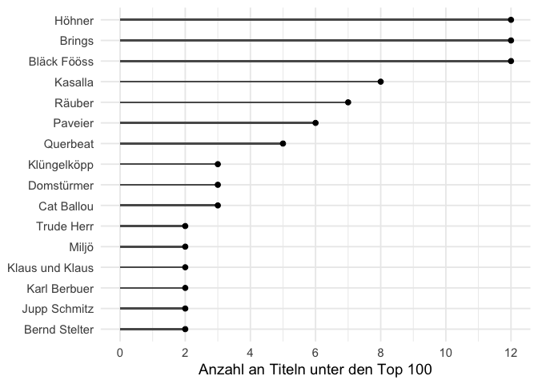
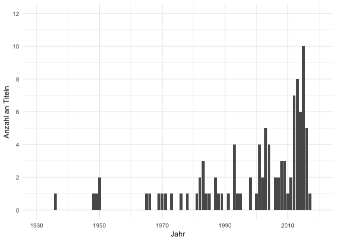
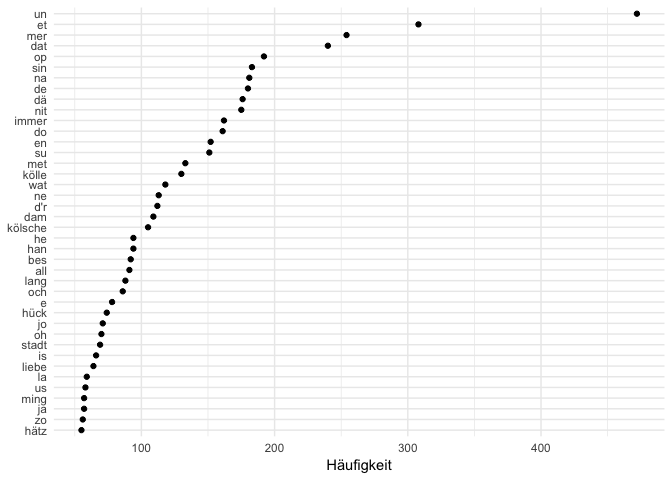
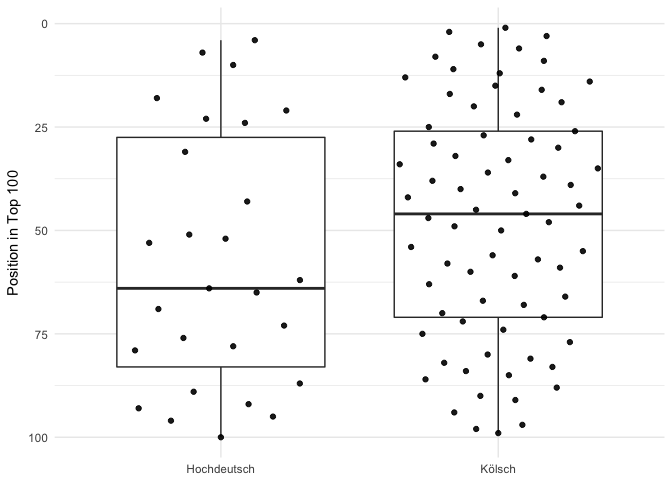
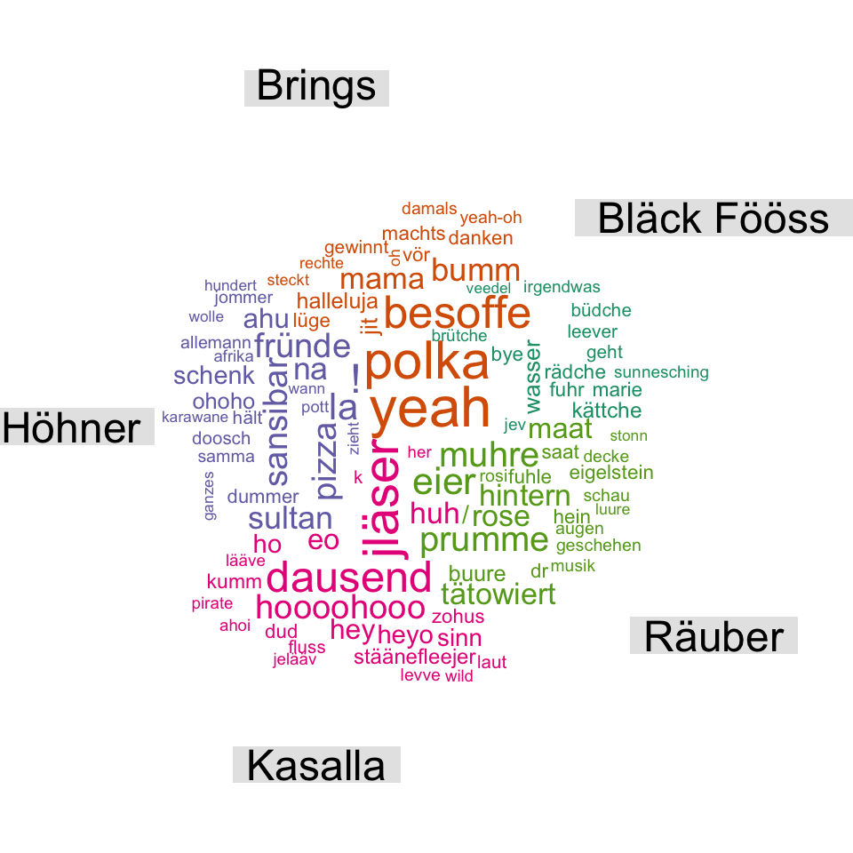
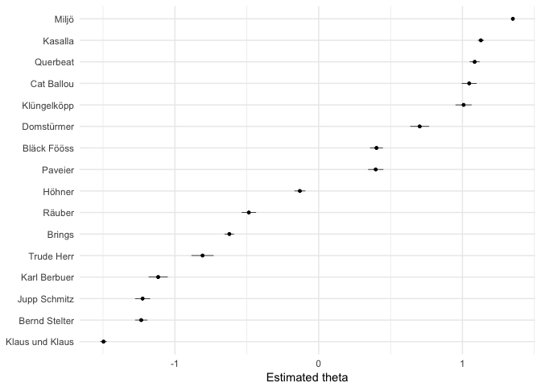

Eine quantitative Textanalyse der 100 beliebtesten kölschen Karnevalslieder
================
Stefan Müller

Die Website [karnevalslieder.koeln](http://www.karnevalslieder.koeln/top-100.html) hat sich den Aufwand gemacht, die am 100 häufigsten auf Youtube gespielten kölschen Karnevalslieder zu suchen. Die Tabelle findet sich [hier](www.karnevalslieder.koeln). Um zwei meiner Hobbies (Karneval und quantitative Textanalyse) zu verknüpfen, habe ich einen Textkorpus erstellt, der den alle Songtexte dieser Top-100-Songs enthält. Hier zeige ich, welche Bands am häufigsten vertreten sind und wie sich die Wortwahl unterscheidet (und gebe gleichzeitig noch einen Einblick in quantitative Textanalyse mit dem [**quanteda**-Package](www.quanteda.io) sowie data wrangling und plotting mit der [**tidyverse**](www.tidyverse.org)).

Dies sind die Top-10 Songs basierend auf den Youtube-Aufrufen:

``` r
data %>% 
    select(Rang, Interpret, Titel, Jahr) %>% 
    filter(Rang <= 10) %>% 
    knitr::kable()
```

|  Rang| Interpret                               | Titel                     |  Jahr|
|-----:|:----------------------------------------|:--------------------------|-----:|
|     1| Brings                                  | Kölsche Jung              |  2013|
|     2| Kasalla                                 | Pirate                    |  2011|
|     3| Cat Ballou                              | Et jitt kei Wood          |  2012|
|     4| Trude Herr                              | Ich will keine Schokolade |  1965|
|     5| Brings                                  | Polka, Polka, Polka       |  2014|
|     6| Kasalla                                 | Alle Jläser huh           |  2014|
|     7| Höhner                                  | Schenk mir Dein Herz      |  2009|
|     8| Paveier                                 | Leev Marie                |  2015|
|     9| Kasalla                                 | Stadt met K               |  2015|
|    10| Mo-Torres & Cat Ballou & Lukas Podolski | Liebe Deine Stadt         |  2016|

Für alle Nicht-Karnvelisten: Das hier ist Numero Uno: <https://www.youtube.com/watch?v=DcNPqsWPbD8>

Im nächsten Schritt analysieren wir, welche Bands die meisten Songs unter den Youtube-Top-100 haben.

``` r
# Berechne die Anzahl der Top 100-Liedern pro Interpret
data_by_artist <- data %>% 
    group_by(Interpret) %>% 
    summarise(number_songs = n()) %>% 
    filter(number_songs > 1) 

# Erstelle Plot
ggplot(data_by_artist, aes(x = reorder(Interpret, number_songs), y = number_songs)) + 
    geom_point(stat = "identity", size = 2) +
    scale_y_continuous(limits = c(0, 12), breaks = c(seq(0, 12, 2))) +
    coord_flip() +
    labs(x = NULL, y = "Anzahl an Titeln unter Top 100")
```



Wie zu erwarten, teilen sich die "Fööss", Höhner und Brings Platz 1 mit jeweils 12 Liedern. Im nächsten Schritt schauen wir, aus welchen Jahren die Lieder stammen. Da das Yotube-Publikum generell jünger ist und viele der alten Klassiker (leider) womöglich nicht kennt, ist es zu vermuten, dass die meisten Songs aus den letzten 10-15 Jahren stammen.

``` r
# Berechne die Anzahl der Top 100-Liedern pro Jahr
data_by_year <- data %>% 
    group_by(Jahr) %>% 
    summarise(number_songs = n()) 

# Erstelle Plot
ggplot(data_by_year, aes(x = Jahr, y = number_songs)) + 
    geom_bar(stat = "identity", size = 2) +
    scale_x_continuous(limits = c(1930, 2020), breaks = c(seq(1930, 2020, 20))) +
    scale_y_continuous(limits = c(0, 12), breaks = c(seq(0, 12, 2))) +
    labs(x = "Jahr", y = "Anzahl an Titeln")
```



Tatsächlich wurden die meisten Songs in den 2000ern veröffentlicht.

Und welche Lieder sind die ältesten unter den Top-100?

``` r
data %>% 
    dplyr::select(Jahr, Rang, Interpret, Titel) %>% 
    top_n(n = -10, wt = Jahr) %>% 
    arrange(Jahr) %>% 
    knitr::kable()
```

|  Jahr|  Rang| Interpret         | Titel                                     |
|-----:|-----:|:------------------|:------------------------------------------|
|  1936|    71| Karl Berbuer      | Heidewitzka Herr Kapitän                  |
|  1948|    92| Karl Berbuer      | Die Eingeborenen von Trizonesien          |
|  1949|    23| Jupp Schmitz      | Wer soll das bezahlen                     |
|  1950|    87| Willy Schneider   | Wenn das Wasser im Rhein goldner Wein wär |
|  1950|    95| Toni Steingass    | Der schönste Platz ist immer an der Theke |
|  1965|     4| Trude Herr        | Ich will keine Schokolade                 |
|  1966|    73| Ernst Neger       | Humba Tätärä                              |
|  1969|    96| Jupp Schmitz      | Es ist noch Suppe da                      |
|  1970|    79| Margit Sponheimer | Am Rosenmontag bin ich geboren            |
|  1971|    16| Bläck Fööss       | Drink doch eine met                       |

Quantitative Textanalyse
------------------------

Im nächsten Schritt geht es ans Eingemachte: wir schauen uns die Inhalte der Songtexte an. Zunächst erstellen wir dafür mit dem **quanteda**-Package einen Textkorpus.

``` r
# Erstelle Text-Korpus des data frames
corpus_leeder <- corpus(data, text_field = "text") 
corpus_leeder
```

    ## Corpus consisting of 100 documents and 6 docvars.

``` r
# Erstelle bessere Namen für Songs
docnames(corpus_leeder) <- paste(docvars(corpus_leeder, "title_short"),
                                 docvars(corpus_leeder, "Jahr"), sep = ", ")
```

Nun nutzen wir die Keyword-in-Context-Funktion, um zu schauen, in welchen Zusammenhängen die Worte "fiere", "drink" und "alaaf" vorkommen. Hierbei wird nicht zwischen Groß- und Kleinschreibung unterschieden.

``` r
# Keyword-in-Context-Analyse
kwic(corpus_leeder, c("fiere*", "drink*", "alaaf"), window = 3)
```

    ##                                                                         
    ##   [Polka, P, 2014, 48]      mer et Lävve |  fiere  | . Polka,           
    ##   [Alle Jlä, 2014, 18]      met Dir eine | drinke  | jonn,(             
    ##  [Alle Jlä, 2014, 130]      Dud Kumm mer | drinke  | uch met denne      
    ##  [Alle Jlä, 2014, 168]         du jet ze |  fiere  | häs,(              
    ##  [Alle Jlä, 2014, 272]      Dud Kumm mer | drinke  | uch met denne      
    ##  [Alle Jlä, 2014, 300]      Dud Kumm mer | drinke  | uch met denne      
    ##  [Alle Jlä, 2014, 392]      Dud Kumm mer | drinke  | uch met denne      
    ##  [Alle Jlä, 2014, 420]      Dud Kumm mer | drinke  | uch met denne      
    ##  [Alle Jlä, 2014, 468]        ) Kumm mer | drinke  | uch met denne      
    ##  [Stadt me, 2015, 128]          is laut, |  drink  | vill un schwaad    
    ##      [Helau, 2015, 58]       do säht mer |  Alaaf  | . Ich fing         
    ##   [Drink do, 1971, 15]      jän ens eine | drinken | däht. Doch         
    ##   [Drink do, 1971, 60]       einfach an: |  Drink  | doch eine met      
    ##   [Drink do, 1971, 90]        janz ejal, |  drink  | doch met un        
    ##  [Immer no, 2012, 139]            do, do |  Drink  | mit mir op         
    ##  [Immer no, 2012, 251]            do, do |  Drink  | mit mir op         
    ##  [Immer no, 2012, 332]            do, do |  Drink  | mit mir op         
    ##  [Immer no, 2012, 387]            do, do |  Drink  | mit mir op         
    ##   [Viva Col, 2002, 53]       zum KEC Mir | drinke  | jän e Kölsch       
    ##   [Viva Col, 2002, 72]      jet loss Mir |  fiere  | jän- ejal          
    ##  [Viva Col, 2002, 133]            et he! |  Alaaf  | un Ruusemondaach un
    ##  [Ich bin , 2012, 122]     , heiss Kölle |  Alaaf  | ! Ich deit         
    ##  [Ich bin , 2012, 248]     , heiss Kölle |  Alaaf  | ! Ich rode         
    ##  [Ich bin , 2012, 380]     , heiss Kölle |  Alaaf  | !                  
    ##   [Ich ben , 1982, 19]          mich an: | drinks  | de met mer         
    ##  [Mir sin , 2008, 118]      am Rhing Mer |  fiere  | Fastelovend- mit   
    ##  [Mir sin , 2008, 136]         un FC Mer |  fiere  | uns jän selver     
    ##  [Heimat e, 2011, 117]   Fründe fällt et |  Fiere  | jo nit schwer      
    ##  [Naturbek, 2013, 158]           , Jung, | drinks  | de eine met        
    ##  [Mir Köls, 1994, 207]   : Dreimol Kölle |  Alaaf  | -                  
    ##   [Denn wen, 1993, 68] hätt jesaat Kölle |  Alaaf  | , Alaaf-           
    ##   [Denn wen, 1993, 70]      Kölle Alaaf, |  Alaaf  | - Kölle Alaaf      
    ##   [Denn wen, 1993, 73]      Alaaf- Kölle |  Alaaf  | Jo am 11.11        
    ##  [Denn wen, 1993, 142] hätt jesaat Kölle |  Alaaf  | , Alaaf-           
    ##  [Denn wen, 1993, 144]      Kölle Alaaf, |  Alaaf  | - Kölle Alaaf      
    ##  [Denn wen, 1993, 147]      Alaaf- Kölle |  Alaaf  |

Was sagt uns diese Tabelle: Die Kölner singen gerne über ihre Stadt und trinken ebenso gern. Und in vielen Texten wiederholt sich eine Phrase (Refrain!).

Im nächsten Schritt plotten wir die 40 häufigsten Begriffe über alle Lieder hinweg.

``` r
# Erstelle dfm, entferne deutsche Stopwörter, Nummern und Punktuation
dfm_leeder <- dfm(corpus_leeder,
                  remove = stopwords("german"),
                  remove_punct = TRUE, 
                  remove_numbers = TRUE)

# Plotte die 40 häufigsten Begriffe
most_frequent_words <- textstat_frequency(dfm_leeder, n = 40)
ggplot(most_frequent_words, aes(x = reorder(feature, frequency), y = frequency)) +
    geom_point() + 
    coord_flip() +
    labs(x = NULL, y = "Häufigkeit")
```



Wir sehen, dass dies vor allem "Stoppwörter" sind, die recht wenig Aussagekraft haben. Deshalb wiederholen wir das Ganze und entfernen Wörter, die in über 60 Prozent der Lieder vorkommen.

``` r
# Entferne Begriffe, die in mehr als 60 Prozent der Lieder vorkommen
dfm_leeder_trim <- dfm_leeder %>% 
    dfm_trim(max_docfreq = 0.6)

# Plotte 40 häufigsten Begriffe
most_frequent_words_subset <- textstat_frequency(dfm_leeder_trim, n = 40)
ggplot(most_frequent_words_subset, aes(x = reorder(feature, frequency), y = frequency)) +
    geom_point() + 
    coord_flip() +
    labs(x = NULL, y = "Häufigkeit (ohne Stoppwörter)")
```



Diese Auswahl ist vielsagender. Die Kölner sprechen gerne über sich ("mer", "ming", "sin") und ihre Stadt ("kölle", "kölsche", "stadt").

Wordclouds
----------

Als nächstes fokussieren wir uns auf die Interpreten, die mit mindestens sechs Titeln vertreten sind und erstellen eine Wordcloud basierend auf den [tf-idf-Werten](https://de.wikipedia.org/wiki/Tf-idf-Maß). Grob gesprochen stellt tf-idf diejenigen Begriffe hervor, die von dem jeweiligen Interpreten überproportional vorkommen (verglichen mit allen anderen Interpreten).

``` r
# Nur Gruppen mit mehr als sechs Liedern
corpus_leeder_subset_wordcloud <- corpus_leeder %>% 
    corpus_subset(count_songs > 6)

# Erstelle Wordcloud
corpus_leeder_subset_wordcloud %>% 
    dfm(remove = stopwords("german")) %>% 
    dfm_group(groups = docvars(corpus_leeder_subset_wordcloud, "Interpret")) %>%
    dfm_tfidf() %>% 
    textplot_wordcloud(comparison = TRUE, max.words = 100)
```



Eins fällt auf: manche Lieder haben einen großen Einfluss, beispielsweise "Dausend Leeve" bei Kasalla, "Op de Maat" (Räuber), "Polka, Polka, Polka" (Bläck Fööss) und "Pizza Wunderbar" (Pizza). Denn die Inhalte dieser Lieder sind fundamental anders zu den Titeln der anderen Bands (und beinhalten sich wiederholende Schlagwörter).

Wordfish für Karnevalsbands
---------------------------

Abschließend ein Experiment: Wir nutzen die Scaling-Methode "Wordfish" ([Slapin and Proksch 2008](http://www.svenoliverproksch.com/uploads/1/2/9/8/12985397/slapin_proksch_ajps_2008.pdf)), um alle Bands mit mehr als zwei Songs auf einer eindimensionalen Ebene zu skalieren. Normalerweise wird diese Methode genutzt, um Parteien auf der Links-Rechts-Ebene einzuordnen. Hier vermuten wir eine (uns vorerst unbekannte) Karnevalsdimension (natürlich mit Vorsicht zu genießen!).

``` r
corpus_leeder_subset <- corpus_leeder %>% 
    corpus_subset(count_songs >= 2)

dfm_leeder_subset <- corpus_leeder_subset %>% 
    dfm() %>% 
    dfm_group(groups = docvars(corpus_leeder_subset, "Interpret"))

textmodel_wordfish(dfm_leeder_subset) %>% 
    textplot_scale1d() +
    theme_minimal()
```



Die Dimension macht aber durchaus Sinn: es geht um Platt vs. Hochdeutsch! Während Bands wie Miljö, Kasalla, Querbeat und Cat Ballou fast ausschließlich auf Kölsch singen (zumindest deren Songs in den Top 100), singen u.g. Trude Herr, Karl Berbuer, Jupp Schmitz, Bernd Stelter auf Hochdeutsch. Interessanterweise liegen Brings, Höhner und Bläck Fööss in der Mitte, denn Teile der Songs sind hochdeutsch, andere sind platt. Wer hätte das gedacht: Wordfish für Fastelovend macht Sinn! Und diese Skalierung basierend ausschließlich auf Worthäufigkeiten.

Für mehr Informationen zu Wordfish siehe: Jonathan Slapin and Sven-Oliver Proksch. 2008. "[A Scaling Model for Estimating Time-Series Party Positions from Texts.](http://www.svenoliverproksch.com/uploads/1/2/9/8/12985397/slapin_proksch_ajps_2008.pdf)" American Journal of Political Science 52(3):705-772.

Habe ich Interesse an unserem **quanteda**-Package geweckt? Hier gibt es mehr Informationen:

-   Website: [quanteda.io](www.quanteda.io)
-   Tutorials: [tutorials.quanteda.io](tutorials.quanteda.io)

Aus Urheberrechtsgründen habe ich den Rohdatensatz nicht öffentlich verfügbar gemacht.
